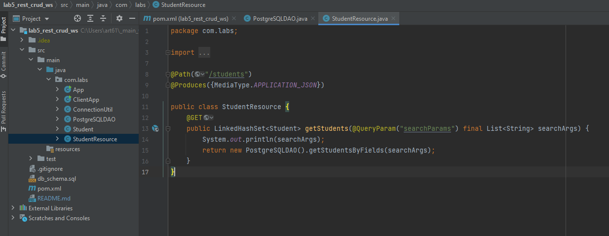
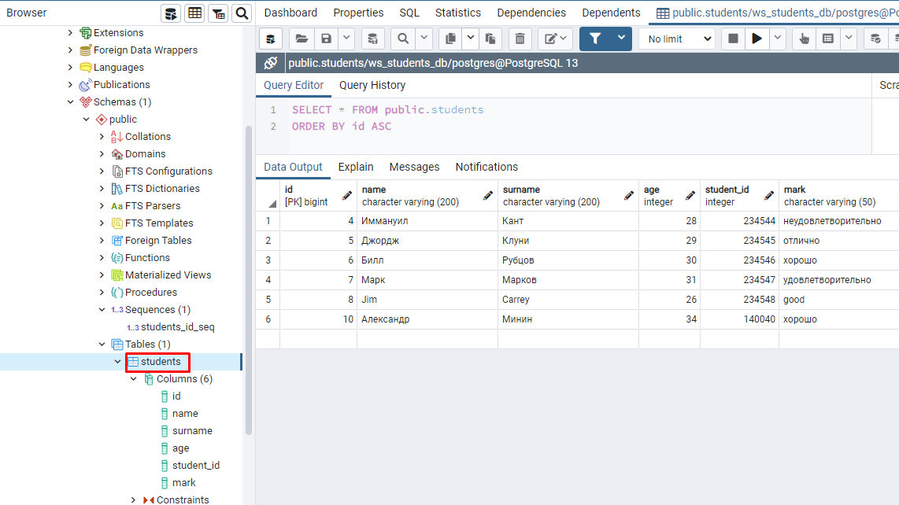
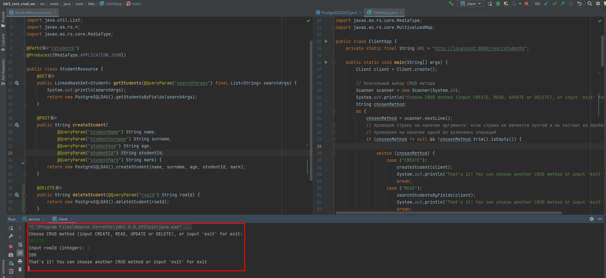
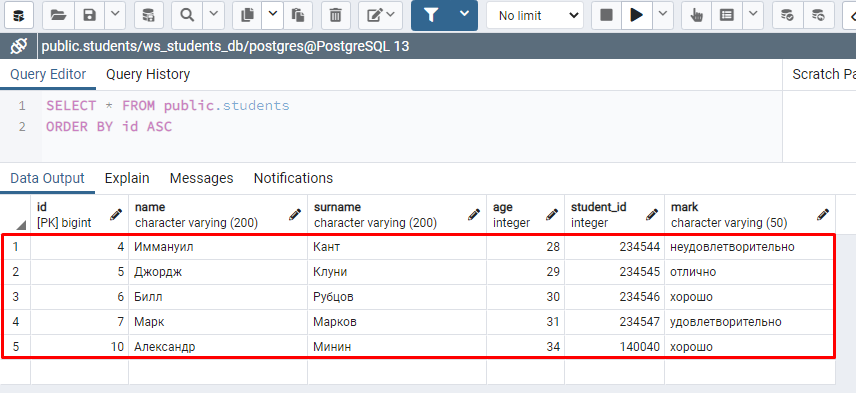
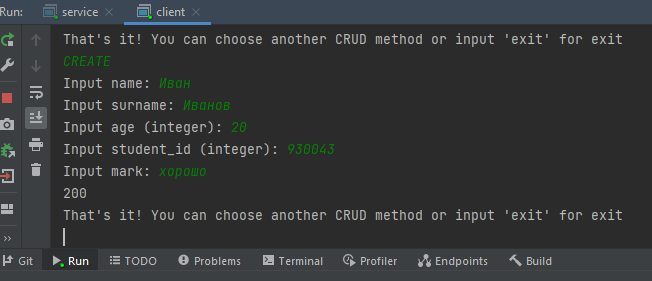
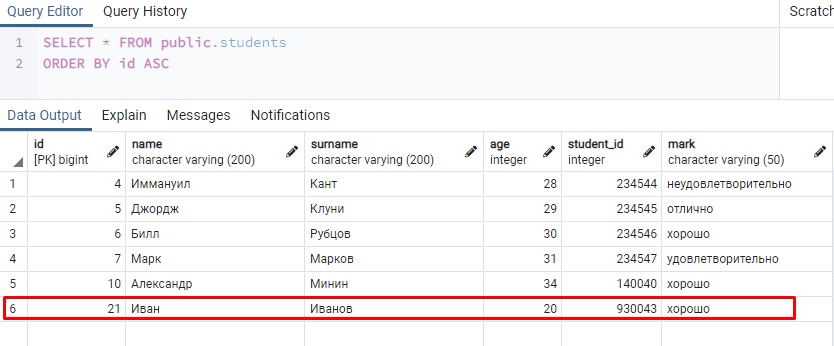

**Лабораторная работа 5. Реализация CRUD с помощью REST-сервиса**

# Реализация CRUD с помощью REST-сервиса

## Задание

> Таблица БД, а также код для работы с ней был взят из предыдущих работ без изменений. 

Выполнить задание из лабораторной работы 2, но с использованием REST-сервиса:

1. В ранее разработанный веб-сервис необходимо добавить методы для создания (CREATE), изменения (UPDATE) и удаления (DELETE) записей из таблицы БД. 
2. Метод создания должен принимать значения полей новой записи, метод изменения - индентификатор изменяемой записи, методы обновления и удаления - статус операции. Необходимо вносить изменения только в standalone-реализацию сервиса. 
3. Соответствующим образом необходимо обновить клиентское приложение.

## Ход работы

В pom.xml оставляем зависимости:

```xml
<dependencies>
        <dependency>
            <groupId>com.sun.jersey</groupId>
            <artifactId>jersey-server</artifactId>
            <version>1.19.4</version>
        </dependency>
        <dependency>
            <groupId>com.sun.jersey</groupId>
            <artifactId>jersey-servlet</artifactId>
            <version>1.19.4</version>
        </dependency>
        <dependency>
            <groupId>com.sun.jersey</groupId>
            <artifactId>jersey-grizzly2</artifactId>
            <version>1.19.4</version>
        </dependency>
        <dependency>
            <groupId>com.sun.jersey</groupId>
            <artifactId>jersey-json</artifactId>
            <version>1.19.4</version>
        </dependency>
        <dependency>
            <groupId>com.sun.jersey</groupId>
            <artifactId>jersey-client</artifactId>
            <version>1.19.4</version>
        </dependency>
        <dependency>
            <groupId>org.postgresql</groupId>
            <artifactId>postgresql</artifactId>
            <version>42.2.20</version>
        </dependency>
    </dependencies>
```

Основной код классов берем из лабораторной работы 4 части 1 (разработка standalone-реализации сервиса). 



Теперь по аналогии с лабораторной работой 2 необходимо добавить реализацию методов CREATE, UPDATE, DELETE, которые будут создавать, обновлять и удалять записи из таблицы в БД.

### Создание записей

Метод должен принимать значения полей для новой записи и возвращать статус операции. Метод createStudent в классе com.labs.StudentResource будет использовать аннотацию `@POST` в соответствии с CRUD. Начальная реализация данного метода:

```java
    @POST
    public String createStudent(
            @QueryParam("studentName") String name,
            @QueryParam("studentSurname") String surname,
            @QueryParam("studentAge") String age,
            @QueryParam("studentId") String studentId,
            @QueryParam("studentMark") String mark) {

        return new PostgreSQLDAO().createStudent(name, surname, age, studentId, mark);
    }
```

Соответствующий метод в PostgreSQLDAO реализуется аналогично лабораторной работе 2:

```java
    public String createStudent(String name, String surname, String age, String studentId, String mark) {
        String status = "-1";
        try (Connection connection = ConnectionUtil.getConnection()) {
            Statement stmt = connection.createStatement();

            int result = stmt.executeUpdate("INSERT INTO students(name, surname, age, student_id, mark) values ('" +
                    name + "', '" + surname + "', " + age + ", " + studentId + ", '" + mark + "');");
            status = Integer.toString(result);

        } catch (SQLException ex) {
            Logger.getLogger(PostgreSQLDAO.class.getName()).log(Level.SEVERE, null, ex);
        }

        return status;
    }
```

Для проверки сразу же добавим реализацию метода createStudent в класс ClientApp, причем используем также код для запроса данных из консоли из лабораторной работы 2.

### Удаление записей

Удаление также как и в лабораторной работе 2 будем производить при помощи полученного идентификатора записи rowId в таблице БД. Изначально добавляем соответствующий метод с аннотацией в класс StudentResource:

```java
@DELETE
public String deleteStudent(@QueryParam("rowId") String rowId) {
	return new PostgreSQLDAO().deleteStudent(rowId);
}
```

Далее добавляем метод в PostgreSQLDAO:

```java
public String deleteStudent(String rowId) {
	String status = "-1";
	try (Connection connection = ConnectionUtil.getConnection()) {
		Statement stmt = connection.createStatement();
		int result = stmt.executeUpdate("DELETE FROM students WHERE id='" + rowId + "';");
		status = Integer.toString(result);
	} catch (SQLException ex) {
		Logger.getLogger(PostgreSQLDAO.class.getName()).log(Level.SEVERE, null, ex);
	}
		return status;
}
```


## Реализация клиентского приложения

Как было указано ранее, мы используем код из лабораторной работы 2, в котором будем запрашивать в консоли выбор CRUD метода через switch-case, а затем вызывать соответствующий метод. 

Таким образом для метода CREATE мы вызываем метод createStudent() и передаем в качестве аргумента объект класса Client. Далее мы запрашиваем через консольный ввод необходимые параметры и простейшим образом проверяем то, что параметры не являются пустыми, а также, что определенные параметры могут быть приведены к целым числам. После этого выполняем запрос через queryParam и для получения ответа используем метод post():

```java
WebResource webResource = client.resource(URL);

webResource = webResource.queryParam("studentName", name).queryParam("studentSurname",
                        surname).queryParam("studentAge", age).queryParam("studentId",
                        studentId).queryParam("studentMark", mark);

ClientResponse response = webResource.accept(MediaType.APPLICATION_JSON).post(ClientResponse.class);
if (response.getStatus() != ClientResponse.Status.OK.getStatusCode()) {
	throw new IllegalStateException("Request failed");
}
System.out.println(response.getStatus());
```

Также получаем ответ и выводим статус ответа в консоль.

Реализация метода DELETE в классе клиента отличается от реализации из лабораторной работы 2 только запросом с методом `delete(ClientResponse.class)`:

```java
private static void deleteStudent(Client client) {

        // Консольный ввод аргументов
        Scanner scanner = new Scanner(System.in);

        System.out.print("Input rowId (integer): ");
        String rowId = scanner.nextLine();

        try {
            Integer.parseInt(rowId.trim());

            WebResource webResource = client.resource(URL);
            webResource = webResource.queryParam("rowId", rowId);
            ClientResponse response = webResource.accept(MediaType.APPLICATION_JSON).delete(ClientResponse.class);
            if (response.getStatus() != ClientResponse.Status.OK.getStatusCode()) {
                throw new IllegalStateException("Request failed");
            }
            System.out.println(response.getStatus());

        } catch (NumberFormatException ex) {
            System.out.println("Incorrect rowId value! Input just one integer.");
        }
    }
```


Для проверки работы клиентского приложения дополнительно используем клиент pgAdmin, чтобы проверять результаты добавления, изменения и удаления записей в таблице БД напрямую:



Например, удалим запись с идентификатором 8, для чего запускаем сначала сервис, а затем клиент и выполняем соответствующий запрос через консоль:



Проверяем результат через pgAdmin:



Теперь точно также добавим новую запись с полями:

* name = Иван
* surname = Иванов
* age = 20
* studentId = 930043
* mark = хорошо



Проверяем через pgAdmin:




